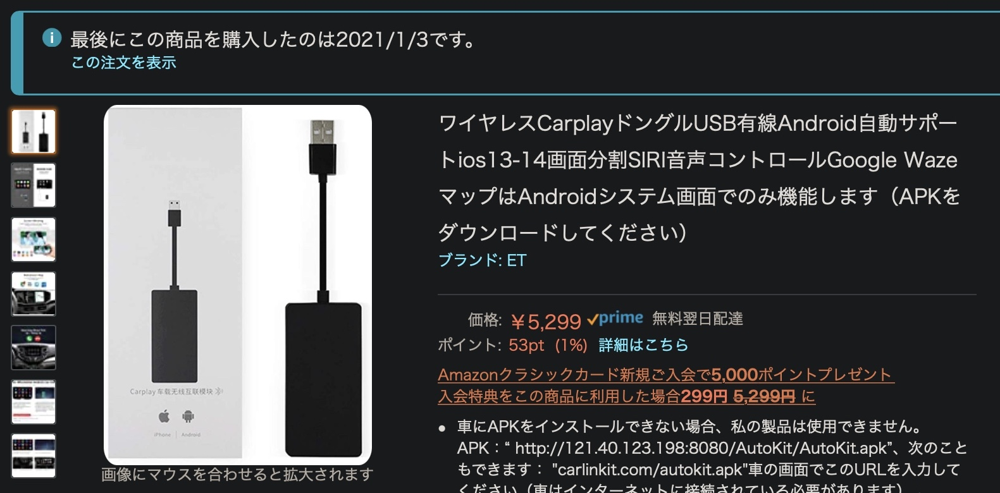
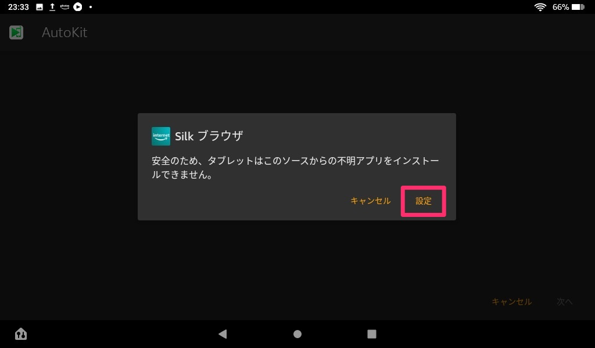
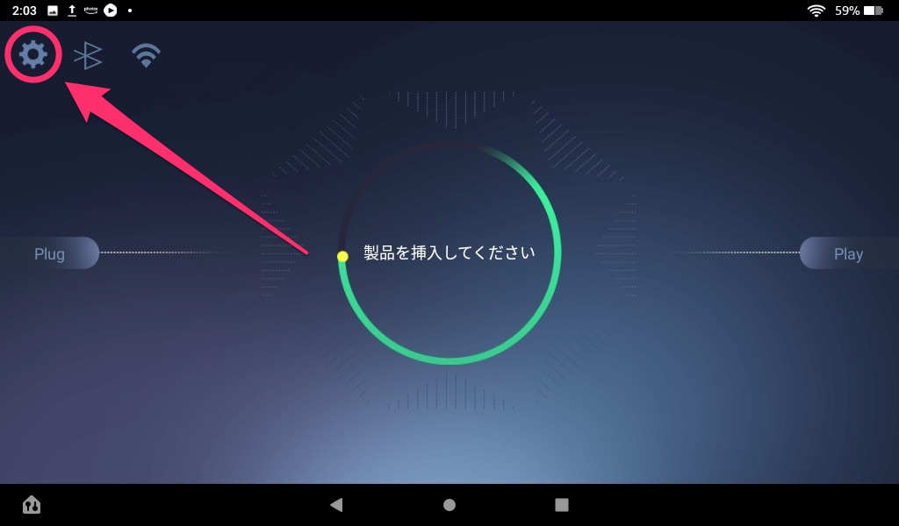
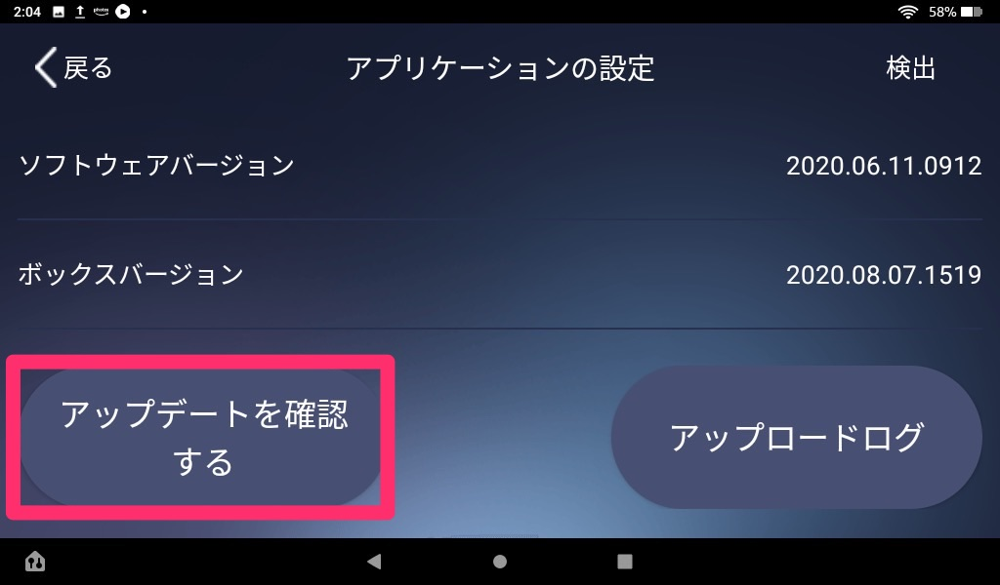
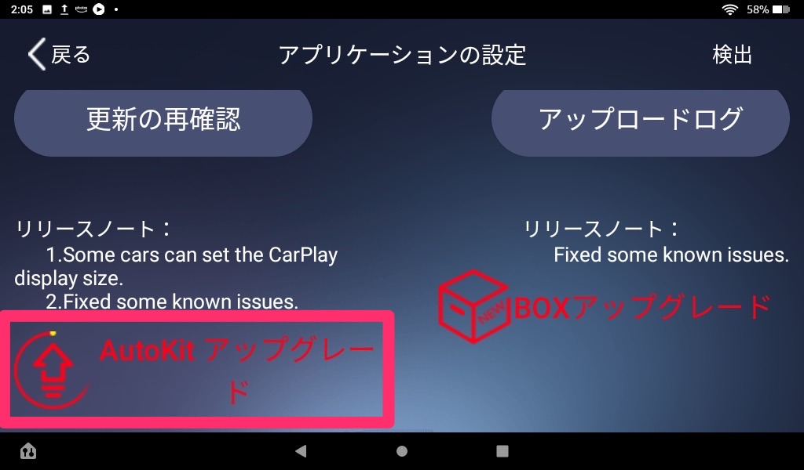
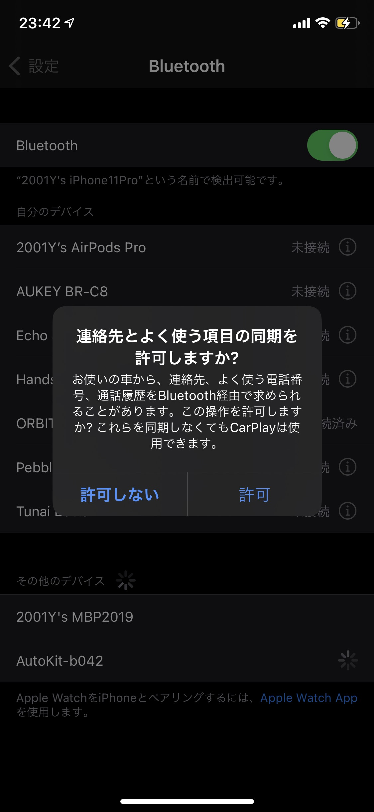
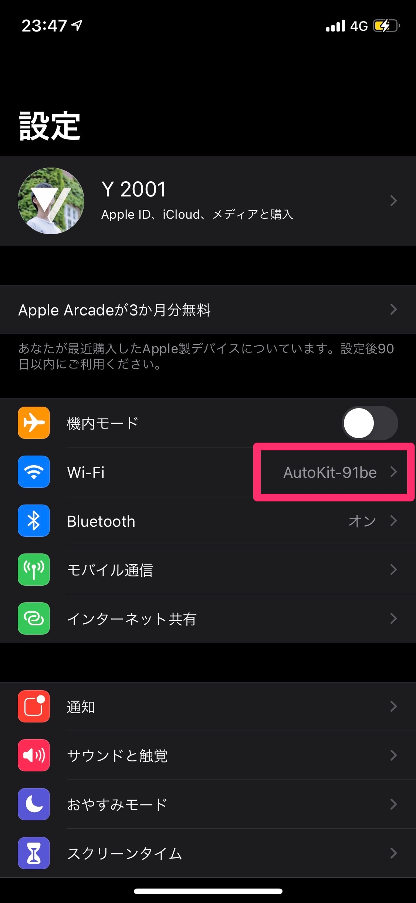
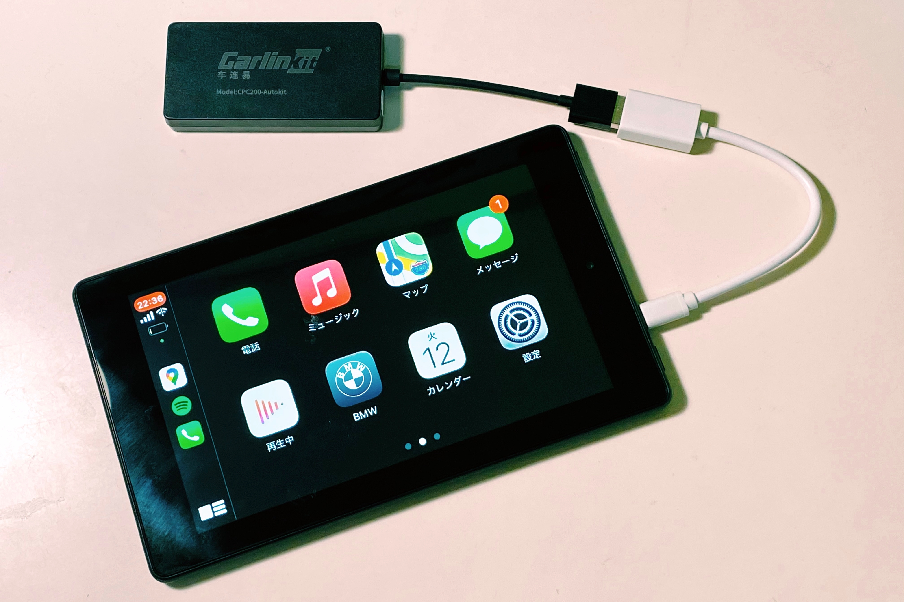

自分が自由に使っていい車ができてから、運転する機会が非常に増えました。

最初の頃は駅までの往復や、すでに知っている場所への運転ばかりでしたが、少し遠くの知らない場所へ行くためにはナビが必須になってきます。

乗っている車にも一応ナビがついているのですが、東京スカイツリーすら登録されていないような古いマップデータであったり、まず反応が悪くてiPhoneやiPadに慣れていると使う気になれません。

そこで、今まではiPhoneでGoogleマップを使っていましたが、<b>安くCarPlayを導入することはできないか</b>と考えました。



## ディスプレイにはFireタブレット

そもそも、古い車なので高価なCarPay対応ナビを買うことは選択肢にありません。手持ちのiPad mini5をナビ代わりにしてもいいけど、毎回つけ外しをするならiPhoneでいいやってなってしまいそう。

そこで、ディスプレイとして格安の<b>Fireタブレット</b>をチョイス。

[Fireタブレット](https://amzn.to/2Xsg026)はAmazonの販売するタブレットで、画面サイズは7〜10インチ、値段は5,980〜15,980円と超破格のタブレットです。でも、毎回と言えるほどいろんなセールの度にさらに安くなっているので通常価格で買うのはもったいないかも。

自分も7インチを4,000円以下で買った記憶があります。

<iframe style="width:120px;height:240px;" marginwidth="0" marginheight="0" scrolling="no" frameborder="0" src="//rcm-fe.amazon-adsystem.com/e/cm?lt1=_blank&bc1=FFFFFF&IS2=1&bg1=FFFFFF&fc1=000000&lc1=0000FF&t=y2001920t-22&o=9&p=8&l=as4&m=amazon&f=ifr&ref=as_ss_li_til&asins=B07JQP28TN&linkId=5e8253d7700779d47f4aeb827acb9cfe"></iframe><iframe style="width:120px;height:240px;" marginwidth="0" marginheight="0" scrolling="no" frameborder="0" src="//rcm-fe.amazon-adsystem.com/e/cm?lt1=_blank&bc1=FFFFFF&IS2=1&bg1=FFFFFF&fc1=000000&lc1=0000FF&t=y2001920t-22&o=9&p=8&l=as4&m=amazon&f=ifr&ref=as_ss_li_til&asins=B07WJSJ28X&linkId=7559d00d13e61d7c3544b81c54c5308d"></iframe><iframe style="width:120px;height:240px;" marginwidth="0" marginheight="0" scrolling="no" frameborder="0" src="//rcm-fe.amazon-adsystem.com/e/cm?lt1=_blank&bc1=FFFFFF&IS2=1&bg1=FFFFFF&fc1=000000&lc1=0000FF&t=y2001920t-22&o=9&p=8&l=as4&m=amazon&f=ifr&ref=as_ss_li_til&asins=B07KD6TPT6&linkId=ca2d11e6e0605af22d8b56840c05c274"></iframe>

そんなFireタブレットでCarPlayが動作すれば最高だなと思い、調べてみるとFireHD8でCarPlayが動作している[動画](https://youtu.be/yqSm5vlLCfo)を見つけました。

どうやら、Carlinkitという会社が<b>AndroidナビでCarPlayを使えるようにするデバイス</b>を販売していて、Android端末はもちろん、Androidベースで作られているFireタブレットでもCarPlayが実現できるみたい。

これは試すしかない。



## Carlinkitのドングルを用意する

Carlinkitは[CarPlay非対応の車標準のナビをCarPlay対応にさせるドングル](http://carlinkit.com/ycpsj)や[有線CarPlay対応のナビを無線CarPayに対応させるドングル](http://carlinkit.com/productinfo/447590.html)なども取り扱っているようです。

ただ今回はAndroidナビをCarPayに対応させるため、この二つが候補になります。



**Android USB CarPlay Dongle** 　　[http://carlinkit.com/productinfo/354763.html](http://carlinkit.com/productinfo/354763.html)

**Android Wireless CarPlay Dongle** 　　[http://carlinkit.com/productinfo/378738.html](http://carlinkit.com/productinfo/378738.html)



名前の通り、1つ目は有線のCarPlayのみ、2つ目は無線のCarPlayに対応しています。また、日本のAmazonで買うと以下が正規品らしいです。



**Android USB CarPlay Dongle**｜￥3,599 　　[https://amzn.to/38qlO2i](https://amzn.to/38qlO2i)

**Android Wireless CarPlay Dongle**｜￥9,999 　　[https://amzn.to/3q2r8yO](https://amzn.to/3q2r8yO)



### MicroUSBとUSB-AのOTG対応アダプタを用意する

あとは適当にFireタブレットにドングルを接続するために、OTG対応のMicroUSBとUSB-Aのアダプタを用意します。



**OTG対応のMicroUSBとUSB-Aのアダプタ** 　　[https://amzn.to/3nxAxww](https://amzn.to/3nxAxww)



***

ただ、自分はロゴは入っていないとしても、どうせ中身は同じだろうという安易な考えで、ロゴが消された[怪しい方](https://amzn.to/2LjTu8T)を買ってみました。

値段は￥5,299 と正規品の半額ですが、案の定しっかりとCarlinkitのロゴが入った商品が届き、ちゃんと動きました。

Amazonなら返品もできそうだし、チャレンジしてみる価値はあるかも。



## AutoKitのダウンロード・インストール

ドングルを手に入れたら、今度はソフトウェアを取得していきます。



[http://121.40.123.198:8080/autokit/autokit.apk](http://121.40.123.198:8080/autokit/autokit.apk)



Fireタブレットに標準でインストールされている<b>Silkブラウザ</b>を使って、上記のURLを開き、apkファイルをダウンロードします。

ダウンロードした<b>autokit.apk</b>開きます。

Fireタブレットでは、基本的に**Amazonアプリストア**からしかアプリのインストールができない設定になっているので、これから<b>不明なアプリのインストール</b>を許可するように設定を変更していきます。

Silkブラウザからの<b>不明なアプリのインストール</b>を許可します。許可したら左上の矢印からインストール作業に戻ります。

AutoKitをインストールしていきます。

AutoKitを開くと、<b>ファイル,マイク,カメラへのアクセス許可</b>が求められると思うので許可します。

## AutoKitとドングルのアップデート

これでAutoKitが使えるようになりました。次に左上の設定から<b>AutoKitを最新版にアップデート</b>します。

設定の最下部から**アップデートを確認**を行います。

アップデートがある場合は実行します。

必要に応じて、再度設定から<b>BOX（ドングル）</b>のアップデートも実行します。

これで準備は完了。あとはiPhoneを接続するだけ。



## iPhoneをCarPlayに接続

### 有線でCarPlayに接続

有線のドングルの場合はドングルについているUSBポートにLightningでiPhoneを接続するだけで、通常のCarPlayの挙動をするはずです。

### 無線でCarPlayに接続

今回は無線のドングルを使っているので、iPhoneの設定のBluetoothを開きます。そうしたら、AutoKitからペアリング要求がくるので指示に従って設定していきます。

流れとしてはBluetoothに接続すると、自動的にWiFiが"AutoKit"に切り替わりBluetoothの接続は解除されます。



## さいごに

最初はGoogleマップよりAppleマップの方が音声案内がわかりやすいと思うこともありましたが、ラベル機能がとても便利でやはりGoogleマップを使いがちです。

軽く触ってみた感じ、心配していたFireタブレット側のスペック不足はFire7でも挙動には問題なさそう...？

CarPlayはiPhoneのサブモニタのような感覚で、操作自体はiPhoneで済ませることが多いからか、特に不満は感じませんでした。

あと、無線のCarPlayを触ったのが初めてで、やはり有線に比べるとケーブルを刺すという手間が省けるのは嬉しい。充電の減りは早くなるので充電は必須かも。

ただ、Qiを使えば置くだけでiPhoneを充電できるのでGood👍

