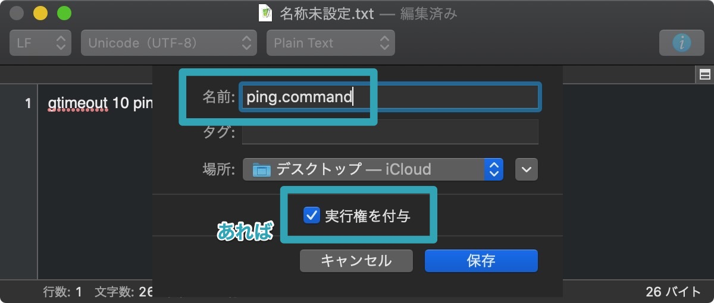

普段からターミナルを使わないぼくみたいな人は、コマンドをすぐ忘れてしまう。そうじゃなくても、何度も同じコマンドを実行するときはとても面倒。

## 拡張子.command

**拡張子：command** ファイルを使うことで簡単にダブルクリックでコマンドが実行できるようになる。これはAutomatorのようにバックグラウンドで動くのではなく、ターミナルのウィンドウを開きコマンドを実行する。

### 適当なエディタで新規テキストファイルを作成する。

](../../../images/mac-command-file-1.jpg)

### .commandファイルとして保存する。

あとで書き換えてもいいが、保存時に.txtを.commandに書き換えておく。あと、"実行権限の付与"の項目があればチェックを入れておく。

"実行権限の付与"の項目がなければ、chmod コマンドを使う。

<iframe style="width:100%;height:155px;margin:15px 0;max-width:680px;" src="https://hatenablog-parts.com/embed?url=https://2001y.me/blog/gadget/mac-chmod/" frameborder="0" scrolling="no"></iframe>