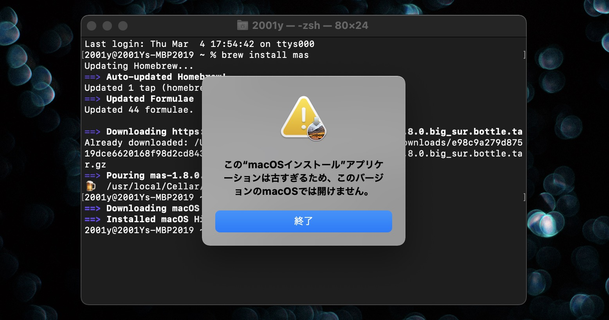



古いiMac(late2009)がリカバリモードから再インストールもできなくなり、起動ディスクを作るためにBigSurでHightSierraをダウンロードしたところうまくいかない。


## AppStoreをコマンドラインから操作できるmasを使う

### 1. ターミナルを開く

**Launchpad**か**アプリケーションフォルダ内のユーティリティフォルダ**から、macOSに標準でインストールされている<b>ターミナルというアプリを開きます。</b>よくわからない場合は ⌘ + スペースキー を押してSpotlightで『ターミナル』と検索。


### 2. Homebrewを使ってmasをインストール

<b>AppStoreをコマンドラインから操作できるmas</b>をHomebrewでインストールするため、以下のコードをターミナルにコピペして`Enter`。

```sh
brew install mas
```

Homebrewをインストールしてない場合は[公式Web](https://brew.sh/index_ja)のコードをターミナルで実行。

### 3. macOSのAppStoreIDを取得

AppStoreIDはAppStoreのリンクに書かれているIDを使用します。

```html
macOS High Sierra の例
https://apps.apple.com/jp/app/macos-high-sierra/id1246284741
                                                  ¯¯¯¯¯¯¯¯¯¯
```

最近のいくつかのIDをまとめてみました。

| OS名                                                         | AppStoreID |
| ------------------------------------------------------------ | ---------- |
| [OS X El Capitan 10.11](https://apps.apple.com/app/os-x-el-capitan/id1147835434) | 1147835434 |
| [macOS Sierra 10.12](https://apps.apple.com/jp/app/macos-sierra/id1127487414) | 1127487414 |
| [macOS High Sierra 10.13](https://apps.apple.com/jp/app/macos-high-sierra/id1246284741) | 1246284741 |
| [macOS Mojave 10.14](https://apps.apple.com/jp/app/macos-mojave/id1398502828) | 1398502828 |
| [macOS Catalina 10.15](https://apps.apple.com/jp/app/macos-catalina/id1466841314) | 1466841314 |

### 4. masで古いmacOSをダウンロード

先ほど取得した<b>AppStoreID</b>を使って古いmacOSをダウンロードします。

```sh
mas purchase [古いmacOSのAppStoreID]
```

今回はHigh Sierraをダウンロードしたいので`mas purchase 1246284741`を実行。


macOSのインストローラーはダウンロードが完了すると自動的にアプリが開くので、これでダウンロード完了。





## USBインストーラを作成

あとは[公式サポート](https://support.apple.com/ja-jp/HT201372)の通り、`createinstallmedia`コマンドなどを使ってUSBインストーラを作成する。`/Volumes/MyVolume`は自分のUSBを指定する。

#### Big Sur

```sh
sudo /Applications/Install\ macOS\ Big\ Sur.app/Contents/Resources/createinstallmedia --volume /Volumes/MyVolume
```

#### Catalina

```sh
sudo /Applications/Install\ macOS\ Catalina.app/Contents/Resources/createinstallmedia --volume /Volumes/MyVolume
```

#### Mojave

```sh
sudo /Applications/Install\ macOS\ Mojave.app/Contents/Resources/createinstallmedia --volume /Volumes/MyVolume
```

#### High Sierra

```sh
sudo /Applications/Install\ macOS\ High\ Sierra.app/Contents/Resources/createinstallmedia --volume /Volumes/MyVolume
```

#### El Capitan

```sh
sudo /Applications/Install\ OS\ X\ El\ Capitan.app/Contents/Resources/createinstallmedia --volume /Volumes
```

## さいごに

`mas install`ではなく、`mas purchase`でないと動かない。