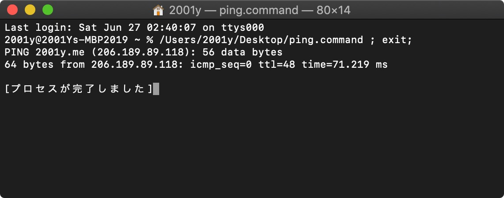
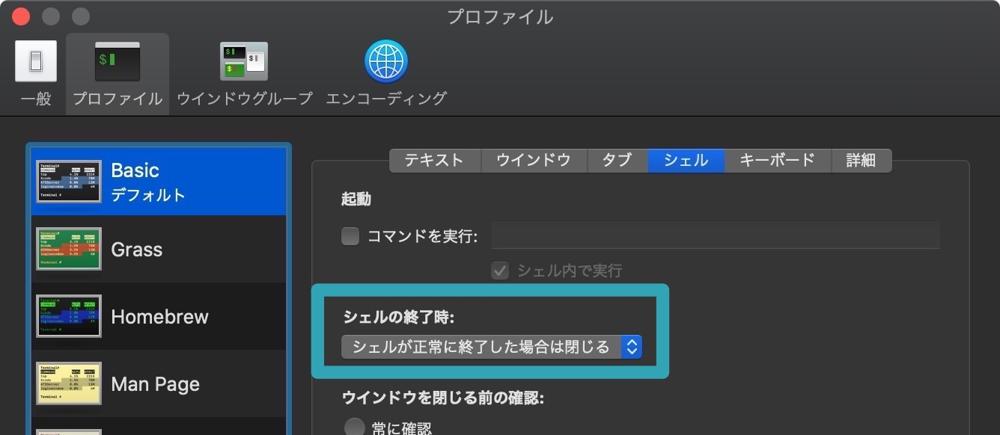

[.commandファイルから起動する時](https://2001y.me/blog/gadget/mac-command-file/)、処理が終わると **[プロセスが完了しました]** と表示されるだけで使い物にならない状態で開きっぱなしにされます。



## 1. 設定から自動的に閉じるように



ターミナルの環境設定から **プロファイル ＞ シェル** の **シェルの終了時** を変更します。

## 2. .commandファイル自体を書き換える

.commandファイルの最後に以下のAppleScriptを加えることで、環境設定を変えることなく、ウィンドウを閉じることができます。

```shell
osascript -e 'tell application "Terminal" to close first window'
```

また、この方法を使うと "AppleScript(osascript)実行中に終了する" という形になり、確認画面を表示させることができます。キャンセルすれば実行記録が見れます。


***

#### 追記

この2つは併用することもできるので、**1.** の設定はしておいて、確認が欲しい時だけ **2.** を追加するという方法でぼくは使ってます。