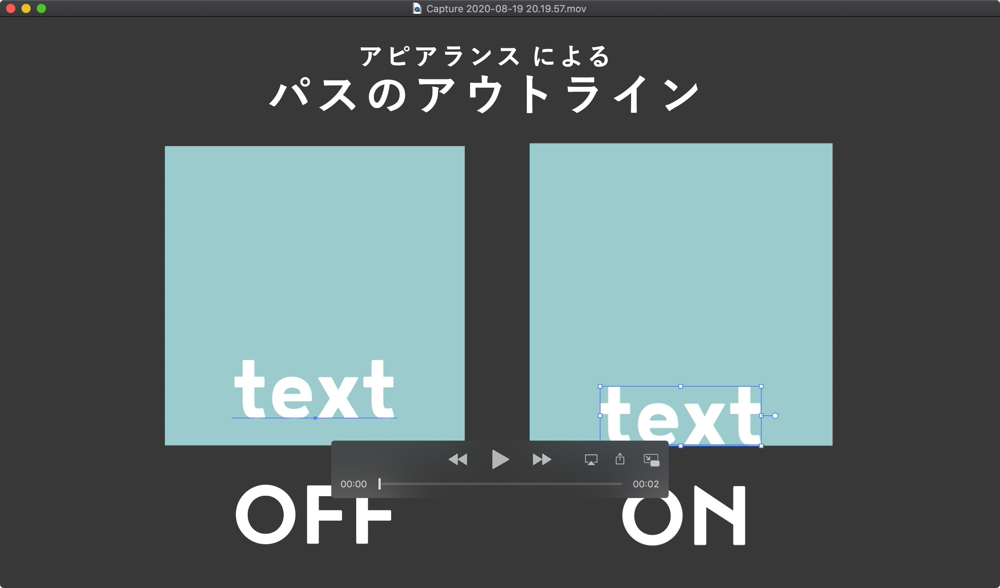
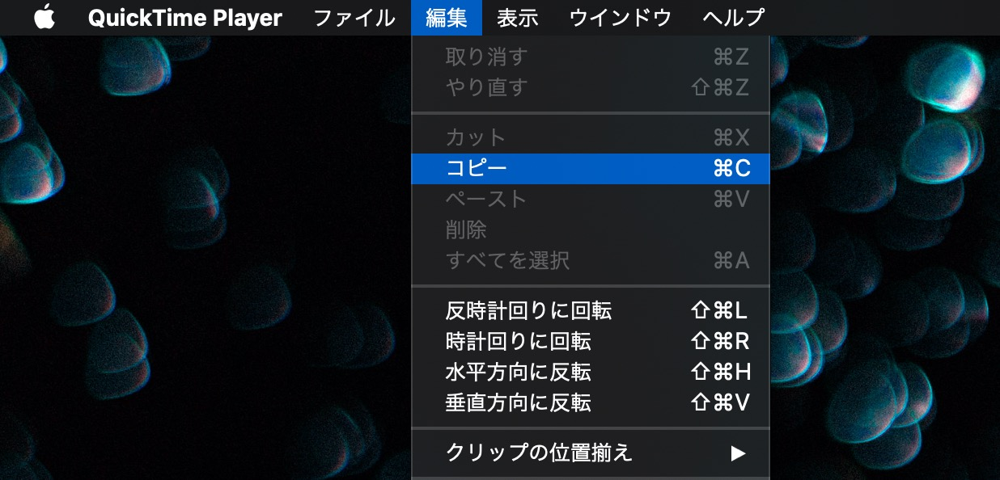
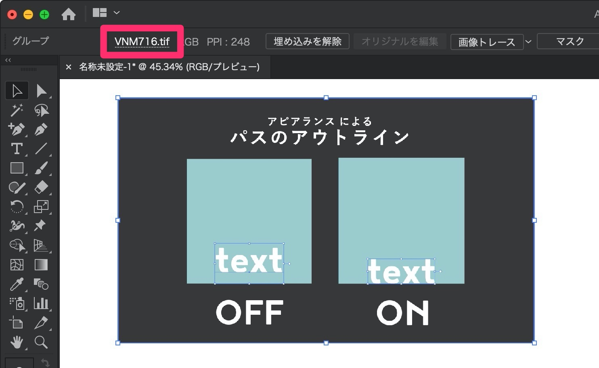
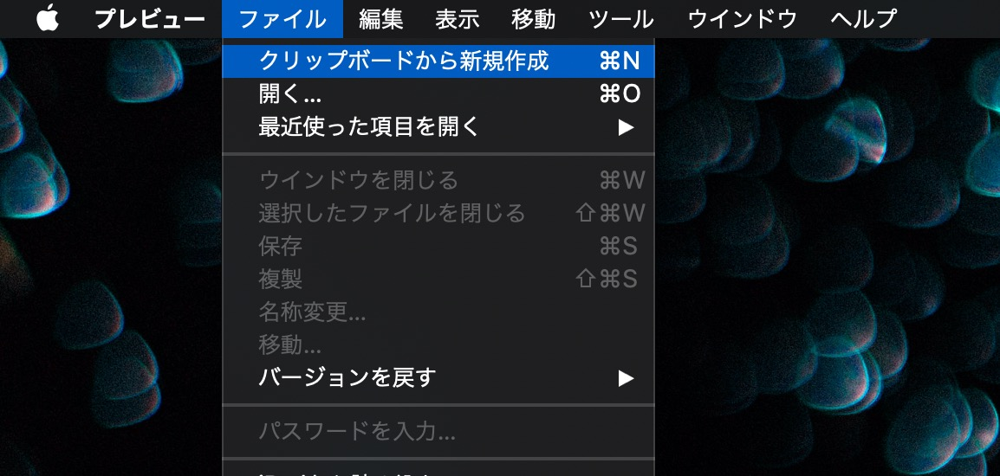

映像から静止画像を取り出したい場面は多いと思います。実際に[一つ前のイラレの記事](https://2001y.me/blog/gadget/illustrator-appearance-textoutline/)を書いている時、スクショでは撮りにくい部分は動画を撮って静止画像を切り抜きました。

そんな動画から静止画を書き出す作業意外とどうすればいいのかわからなかったのですが、調べてみるとQuickTimePlayerのコピペで書き出せたのでメモ。



## 動画をQuickTimePlayerで開いてコピーするだけ

普通に動画ファイルをQuickTimePlayerで開き書き出したいところまで移動して、コピーするだけ。もちろんショートカットでも大丈夫。

これでクリップボードに画像が保存されました。

## あとは普通にペーストするだけ

実際にillustratorにペーストすると画像が貼り付けられます。拡張子はtifになるみたい？場合によって異なるかも。

## 画像として書き出すなら？

クリップボードにコピーされるだけでは画像として書き出せないので、プレビューを開き **クリップボードから新規作成**（ショートカットは`⌘+N`）から好きな拡張子で保存します。

***

シンプルなことでも普段やらないと知らないことって意外と多い...早くiPhone修理しに行かないと

▶︎ [QuickTime Playerを使って映像を1フレームだけ書き出してみよう！](https://www.curioscene.com/how-to-export-one-frame-with-quicktime-player/)