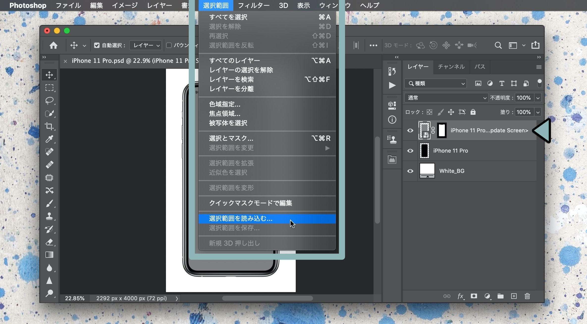
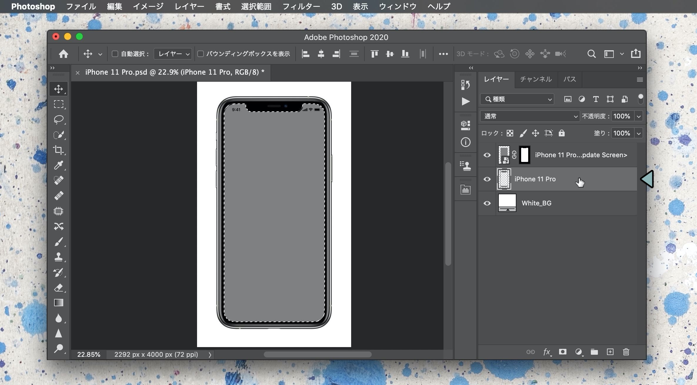

アプリなどを説明する時にスクリーンショットでは味気ないので、実機のフレームをつけることがよくあります。そのようなモックアップを簡単に作れるようなサイトも多くありますが、お粗末なものも多く毎回苦戦していたので、Appleが公式で配布している製品画像から作ってみました。



## フォトショでかんたん、モックアップ作り

### Appleのサイトから製品画像をダウンロード

Appleの[マーケティングリソースとアイデンティティに関するガイドライン](https://developer.apple.com/jp/app-store/marketing/guidelines/#section-products)にアクセスして、作成したい製品のpsdをダウンロードします。

### 上の灰色のレイヤーを選択し、メニューバーから 選択範囲＞選択範囲を読み込む

ダウンロードした`.psd`を開いたら、<b>一番上のレイヤー（灰色の画面部分）</b>を選択した状態で、メニューバーから`選択範囲`＞`選択範囲を読み込む` を選択します。

そのままの設定で`OK`。これで画面部分のみが選択できました。

### 真ん中の製品画像のレイヤーを選択して、delete

真ん中のレイヤー（製品画像）に移動して、`delete`してくり抜きます。ただし、この状態では上のレイヤーに画像が残っているため、<b>視覚的な変化はありません</b>。

### 最後に不要な部分を非表示にして、書き出し

最後に、真ん中の製品画像以外の<b> 画面、背景 のレイヤーを非表示にして</b>、書き出します。これで、画面部分のみくり抜いたデバイスモックアップの完成。

***

Photoshopは普段あまり使わないのですぐ使い方を忘れるので、メモできてよかった。自分で作るときは使えるツールを使えばいいけど、配布物は使うためには色んなツールが使えるようにならないと。