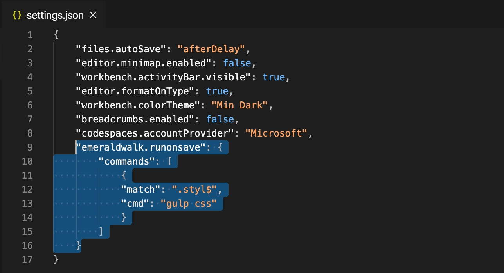

今までAtomを使ってきて、Macが古くなりスペック不足でSublimeに移行していたが、新しいMacも来たことだし、なんとなくVSCodeをトライ中。

そんな中、Sublimeでいう "SublimeOnSaveBuild" 。保存時にStylusのコンパイルを行う方法を調べたのでメモ。

なので、もっといい方法があるかも...。

## とりあえずGulpでStylusコンパイル

AtomとSublimeの間に、高校生の学割を使ってWebStormを使っていた時期があって、その時にGulpを導入したのかな...？でも、サクッと試したい時は面倒だからCodepenを使いがち。

VSCodeには "Live Sass Compiler" があるので、Sassならサクッとコンパイルできそうだけど、Stylusはない。Sassを使えばいいんだけど、CSSからコピペでも動くからStylusが好き。（だったはず...）

なので今回はひとまずGulpで済ませる。

###  拡張機能：Run on Save

tasks.jsonだけでなんとかなるかと思ったけど、逆にこの方法だとtasks.jsonは不要っぽい。

<iframe style="width:100%;height:155px;margin:15px 0;max-width:680px;" src="https://hatenablog-parts.com/embed?url=https://marketplace.visualstudio.com/items?itemName=emeraldwalk.RunOnSave" frameborder="0" scrolling="no"></iframe>

### settings.jsonに拡張子,コマンドを指定

参考＞ [[VSCode]settings.jsonの開き方](https://2001y.me/blog/web/vscode-settingsjson/)



```json
"emeraldwalk.runonsave": {
    "commands": [
        {
        "match": ".styl$", // 拡張子
        "cmd": "gulp css" // 実行コマンド
        }
    ]
}
```

#### Stylus on Gulp

一応、メモ。

```js
let {src, dest}  = require('gulp'),
    cache        = require('gulp-cached'),
		stylus       = require('gulp-stylus'),
    gcmq         = require('gulp-group-css-media-queries'),
    autoprefixer = require('gulp-autoprefixer'),
    minify = require('gulp-minifier');
exports.css = () =>
    src('stylus/*.styl')
        .pipe(cache('css'))
        .pipe(stylus())
        .pipe(gcmq())
        .pipe(autoprefixer({
            stats: ['> 3% in JP']
        }))
        .pipe(minify({
            minify: true,
            minifyCSS: true
        }))
        .pipe(dest('static'))
```

## さいごに

言い切りにしたり、"メモ"って書いちゃうことで自分でメモ感を出すけど、やっぱり慣れない...